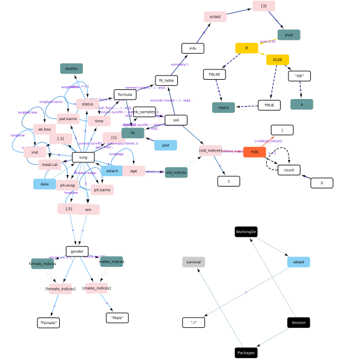

# ScriptMapR

## R Script Visualization in Cytoscape

This function allows the user to represent the content of a given script in 'Cytoscape' (<https://cytoscape.org/>).
Therefore **it is required to have a functioning version of 'Cytoscape' 3.6.1 or greater.**

- Each variable is represented as a node and edges represent commands that call the variable.

- User defined functions are represented and pooled as a group, collapsed and extracted to a subnetwork to avoid latency.

## Color coding

### Nodes

#### A color code is associated to each nodes:

  - white: intermediate variables (that are created and used to create new ones),

  - pink: subsets of a variable (ex: var2 in var1$var2),

  - green: final variables (that are created and not used afterwards),

  - red: warnings, message and stop functions,

  - yellow: if, else if, else and ifelse functions,

  - orange: for, foreach and while functions,

  - blue: *print, cat or other functions at beginning of line,

  - gray: packages import and session info (wd)

### Edges

#### Edge color reports the sequence of command on a blue scale

  - light blue: early in the script 
  - dark blue: late in the script

#### Node color code extend to edges in case of loops or tests 

  - Orange edge bypass: commands within for loop 
  - Yellow edge bypass: commands within if, else, else if, ifelse 

#### Edges of type sinewave represent the connection between a node and itself when used as an indice.

#### Edges of type dots represent the commands within a if, else, else if, ifelse or loop condition.

